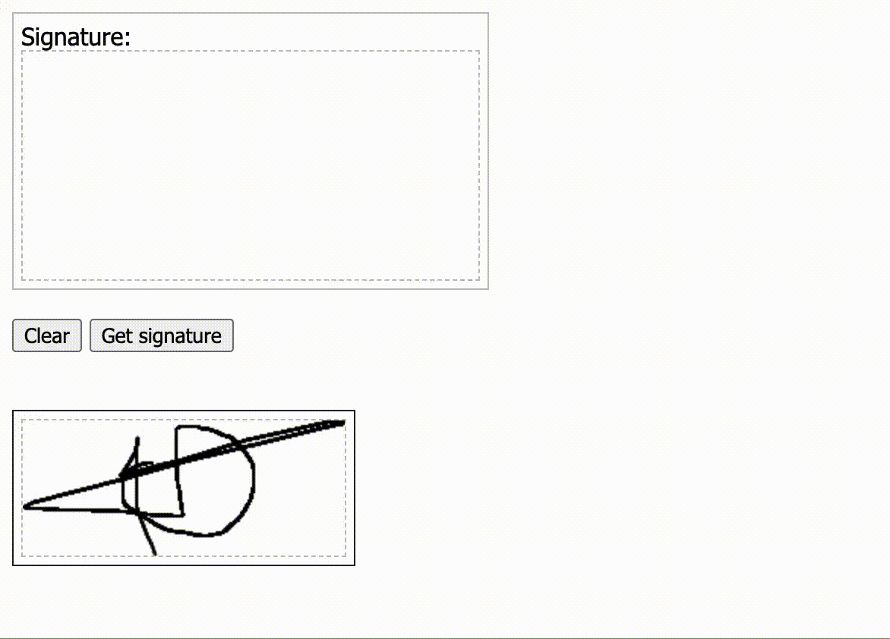

# CanvasSignature

CanvasSignature is a library to create canvas for signatures for both desktop and mobile devices.



### 1. Installation

```html
<link rel="stylesheet" href="dist/canvassignature.min.js">

<div class="signature"></div>
<script>
var signature = CanvasSignature(document.querySelectorAll(".signature"), { });
</script>
```

### 2. Options

| Option | Description | Default value |
| :--- | :--- | :--- |
| width | Canvas width | 200 |
| height | Canvas height | 120 |
| strokeColor | Line color | "black" |
| strokeWidth | Line width | 2 |
| trim | On getSignature method remove empty space | true |


### 3. Methods

```js
var signature = CanvasSignature(document.querySelectorAll(".signature"), { });

// Clear signature canvas
signature.clear();

// Get an array of base64 images for signature from the canvas incase you have multiple instances of CanvasSignature elements
signature.getSignatures();

// Get a single base64 image for signature from the canvas
signature.getSignature();

// Destroys the canvas for signature
signature.destroy();
```